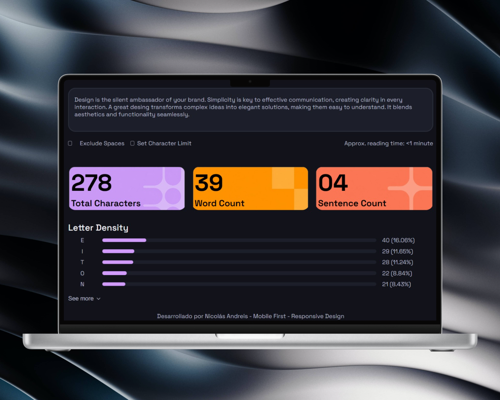
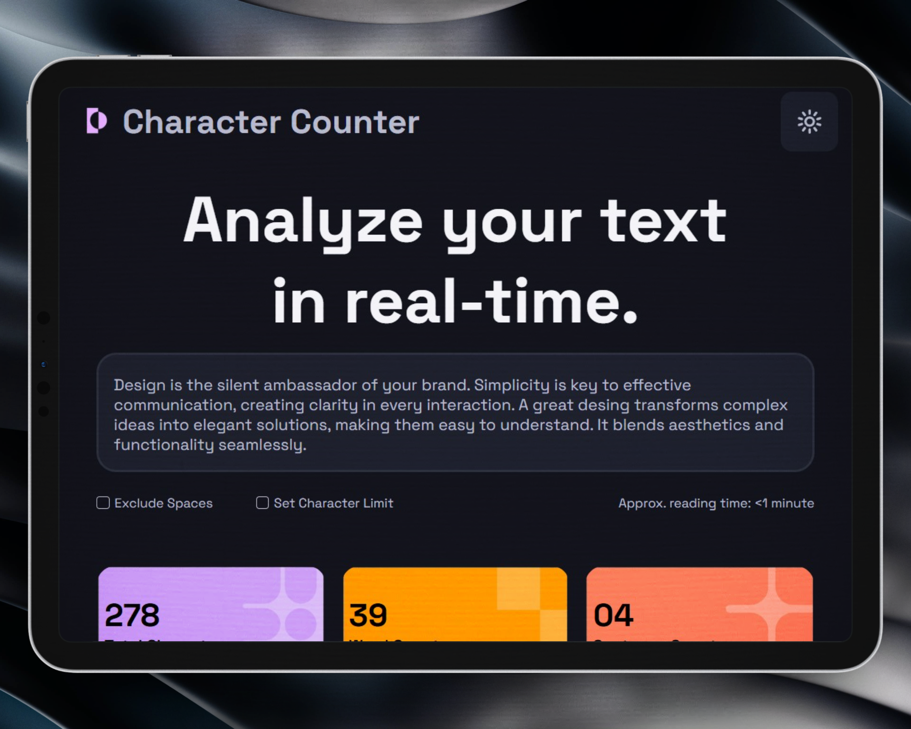

# Character Counter — Proyecto de Maquetado Web

## Objetivo del proyecto

Replicar visualmente la interfaz de una aplicación de conteo y análisis de texto (Character Counter) utilizando únicamente **HTML semántico y CSS**, sin JavaScript. Los valores son estáticos (hardcodeados) como primera etapa del proyecto.

Live Demo

🌐 Demo: https://nicolas-andreis.github.io/Character-Counter/

## Tecnologías utilizadas

- **HTML5** — estructura semántica con etiquetas como `<header>`, `<main>`, `<section>`, `<article>`, `<ul>`, etc.
- **CSS3** — variables CSS, Flexbox y diseño responsive
- **Google Fonts** — [Space Grotesk](https://fonts.google.com/specimen/Space+Grotesk)


## Herramientas extras utilizadas
- **svgrepo**      - iconos
- **tinypng**      - optimizacion de peso de imagenes
- **shots.so**     - mockups
- **github pages** - sitio hosteado

## Organización del HTML

El archivo `index.html` está dividido en tres grandes bloques:

1. **`<header>`** — Logo con ícono SVG y botón de configuración.
2. **`<main>`** — Contiene todas las secciones principales:
   - **Hero** (`<section class="hero">`) — Título + `<textarea>` + controles con checkboxes.
   - **Métricas** (`<section class="metrics">`) — 3 `<article class="card">` con estadísticas.
   - **Letter Density** (`<section class="density">`) — Lista de barras de progreso.

## Cómo se resolvió el CSS

- **Variables CSS (`:root`)** — Paleta de colores, radios de borde, sombras y fuente definidos centralmente.
- **Flexbox** — Usado en header, controles, tarjetas en mobile y filas de densidad.
- **Barras de progreso** — Implementadas con `div` anidados (`.density__bar-track` + `.density__bar-fill`)
- **Checkboxes personalizados**
- **Responsive** — Media queries apto para desktop, tablet y mobile
- **separación** - reset - styles - variables

## Dificultades encontradas

- Haciendolo responsivo, probandolo en diferentes dispositivos tuve que ajustar bastante.

## Capturas del resultado
DESKTOP


TABLET

MOBILE


## Estructura de carpetas

```
proyecto/
├── index.html
├── css/
│   └── mediaqueries/
│   |              └── desktop.css
│   |              └── tablet.css
│   └── reset.css
│   └── styles.css
│   └── variables.css
├── js/
├── assets/
│   └── icons/
│   └── images/
│   |        └── cards/
│   └── logo/
└── README.md
```
